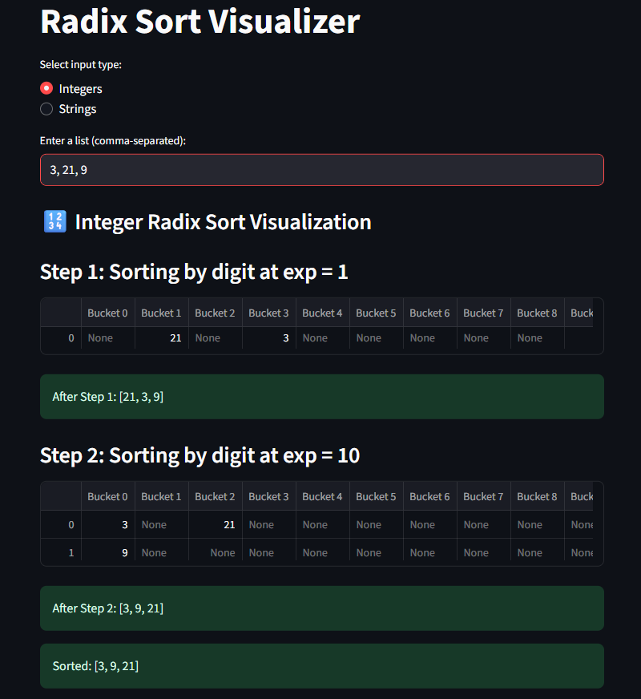

# Radix Sort - Interactive Visualization

## Project Overview

This project is an interactive web application that implements and visualizes Radix Sort Algorithm, developed as part of the Algorithms and Programming II course at Fırat University, Software Engineering Department.

## Algorithm Description


### Problem Definition

Radix Sort solves the problem of sorting a list of integers or strings efficiently without directly comparing the elements. It orders the elements based on their individual digits or characters, handling variable-length inputs and large datasets effectively.

### Mathematical Background

Radix Sort is a non-comparative sorting algorithm that processes numbers (or strings) digit by digit. It relies on the concept of place value in number representation, sorting elements based on individual digits starting from the least significant digit to the most significant digit (LSD approach). Each digit is sorted using a stable sorting method (commonly Counting Sort).

For integers, the algorithm works in base 𝑏 (usually 10 for decimal numbers), and for strings, it considers characters as values from an alphabet set. The sorting order is determined by comparing digits or characters at each position.

### Algorithm Steps

1. ***Find the maximum length***: Determine the number of digits (for integers) or characters (for strings) to process.
2. ***Pad strings if necessary***: For strings, pad shorter ones with spaces to equalize length.
3. ***Process each digit/character from least significant to most significant***:

   • Group elements into buckets based on the current digit or character.

   • Collect elements from buckets back into a list while preserving order.
   
5. ***Repeat*** until all digit/character positions are processed.
   
7. ***Remove padding*** from strings (if applied) to restore original data.

### Pseudocode

```
RadixSort(arr):
    max_len = length of longest element in arr

    for position from max_len - 1 down to 0:
        buckets = array of empty lists indexed by digit/character value

        for element in arr:
            key = digit or character at position in element (pad if necessary)
            buckets[key].append(element)

        arr = concatenate all buckets in order

    if arr contains padded strings:
        remove padding from elements

    return arr

```

## Complexity Analysis

### Time Complexity

• **Best Case:** 𝑂(𝑑 × (𝑛 + 𝑏)) -  Even when the input is already sorted, Radix Sort must process every digit of every element, so the time depends on the number of digits `𝑑`, number of elements 
`𝑛`, and the base `𝑏` (radix).

• **Average Case:** 𝑂(𝑑 × (𝑛 + 𝑏)) - Typically, Radix Sort performs the same operations regardless of the initial order because it sorts digit by digit, scanning all elements and buckets each pass.

• **Worst Case:** 𝑂(𝑑 × (𝑛 + 𝑏)) - The algorithm’s performance does not degrade due to input distribution; it always processes every digit for all elements.

**Where:**
- `𝑑` number of digits.
- `𝑛` number of elements.
- `𝑏` base/radix.
### Space Complexity

• 𝑂(𝑑 × (𝑛 + 𝑏)) - Extra space is needed for the buckets that temporarily hold elements during each pass, plus space for padding in strings if applicable, where n is the number of elements and k is the number of digits or max string length.


## Features

• Interactive visualization of Radix Sort for both integers and strings

• Step-by-step display of sorting passes with bucket contents

• Supports variable-length strings with automatic padding

• User input validation with clear error messages

• Clear display of sorted output after each sorting step

## Screenshots


***This interface allows users to select the input type (integers or strings), enter a comma-separated list, and visualize the step-by-step execution of the Radix Sort algorithm.***

-------------------------------------------------------------------------------------------------



**"Step-by-step visualization of Radix Sort processing the input `[3, 21, 9]`. The algorithm sorts numbers by distributing them into buckets based on each digit position (from least to most significant). Top: Initial grouping by units digit (1s place). Bottom: Final grouping by tens digit (10s place), producing the sorted output `[3, 9, 21]`."***

## Installation

### Prerequisites

- Python 3.8 or higher
- Git

### Setup Instructions

1. Clone the repository:
   ```bash
   git clone https://github.com/FiratUniversity-IJDP-SoftEng/algorithms-and-programming-ii-semester-capstone-project-SaedAbdulRahim.git
   cd algorithms-and-programming-ii-semester-capstone-project-SaedAbdulRahim
   ```

2. Create a virtual environment:
   ```bash
   # On Windows
   python -m venv venv
   venv\Scripts\activate

   # On macOS/Linux
   python3 -m venv venv
   source venv/bin/activate
   ```

3. Install dependencies:
   ```bash
   pip install -r requirements.txt
   ```

4. Run the application:
   ```bash
   streamlit run app.py
   ```

## Usage Guide

1. Open the application by running streamlit run app.py in your terminal.
2. Select the input type: **Integers** or **Strings**.
3. Enter a comma-separated list of numbers or words in the input box.
4. Watch the visualization display the sorting process step-by-step.
5. View the final sorted result shown below the visualization.
6. To sort a new list, simply enter new values and repeat.

### Example Inputs

- **Integers:**

  Input: `170, 45, 75, 90, 802, 24, 2, 66`
  
  Output: `[2, 24, 45, 66, 75, 90, 170, 802]`
- **Strings:**
- 
  Input: `banana, apple, orange, grape, kiwi`
  
  Expected Output: `[apple, banana, grape, kiwi, orange]`
  
- **Short Integer List:**
  
   Input: `3, 21, 9`
  
   Expected Output: `[3, 9, 21]`

## Implementation Details

### Key Components

- `algorithm.py`: Contains the core algorithm implementation.
- `app.py`: Main Streamlit application.
- `utils.py`: Helper functions for data processing.
- `visualizer.py`: Functions for visualization.
- `test_algorithm.py`: Unit tests verifying the correctness of the sorting algorithms for various inputs.

### Code Highlights

```python
def radix_sort_integers(arr):
    """
    Performs Radix Sort on a list of integers.
    Sorts numbers digit by digit starting from the least significant digit.
    """
    if not arr:
        return []
    max_length = len(str(max(arr)))
    for digit in range(max_length):
        buckets = [[] for _ in range(10)]
        for num in arr:
            buckets[(num // 10**digit) % 10].append(num)
        arr = [num for bucket in buckets for num in bucket]
    return arr

def visualize_integer_sort(arr):
    """
    Visualizes each step of the Radix Sort for integers using Streamlit.
    Shows how numbers are distributed into buckets by digit.
    """
    import streamlit as st
    import pandas as pd
    import time

    max_num = max(arr) if arr else 0
    exp = 1
    step = 1
    while max_num // exp > 0:
        st.markdown(f"### Step {step}: Sorting by digit at exp = {exp}")
        buckets = [[] for _ in range(10)]
        for num in arr:
            index = (num // exp) % 10
            buckets[index].append(num)
        bucket_df = pd.DataFrame({f'Bucket {i}': pd.Series(buckets[i]) for i in range(10)})
        st.dataframe(bucket_df)
        arr = [num for bucket in buckets for num in bucket]
        st.success(f"After Step {step}: {arr}")
        exp *= 10
        step += 1
        time.sleep(1)
    return arr
```

## Testing

This project includes a test suite to verify the correctness of the algorithm implementation:

```bash
python -m unittest test_algorithm.py
```

### Test Cases

- **Test integers sorting:**
  
Sorts the list `[170, 45, 75, 90, 802, 24, 2, 66]` and expects the sorted output `[2, 24, 45, 66, 75, 90, 170, 802]`.

- **Test strings sorting:**
  
Sorts the list `["dog", "cat", "apple", "banana"]` and expects the sorted output `['apple', 'banana', 'cat', 'dog']`.


- **Test empty inputs:**
  
Checks that sorting an empty list for both integers and strings returns an empty list `[]`.

## Live Demo

A live demo of this application is available at: [Streamlit](https://saedabdulrahimradix.streamlit.app/)

## Limitations and Future Improvements

### Current Limitations

- The string radix sort only supports lowercase English letters and space characters.
- Visualization speed is fixed and may not be adjustable by the user.
- The application does not handle special characters or Unicode beyond basic ASCII.

### Planned Improvements

- Support for uppercase letters and extended character sets in string sorting.

- Customizable visualization speed and step control


- Enhanced user interface with more detailed explanations and animations

## References and Resources

### Academic References

1. [Hacettepe University - Introduction to Computer Science](https://web.cs.hacettepe.edu.tr/~bbm101/)
   
3. [MIT OpenCourseWare - Introduction to CS and Programming Using Python (Fall 2022)](https://ocw.mit.edu/courses/6-100l-introduction-to-cs-and-programming-using-python-fall-2022/lists/lecture-notes/)

### Online Resources

- [VisuAlgo — Algorithm Visualizations](https://visualgo.net/en)
  
- [Streamlit Official Documentation](https://docs.streamlit.io)

- [GitHub Classroom Guide](https://education.github.com/classroom)

## Author

- **Name:** Saed Abdul Rahim
- **Student ID:** 230543606
- **GitHub:** SaedAbdulRahim

## Acknowledgements

I would like to thank Assoc. Prof. Ferhat UÇAR for guidance throughout this project, and for his continuous encouragement and insightful feedback that greatly contributed to my learning experience..

---

*This project was developed as part of the Algorithms and Programming II course at Fırat University, Technology Faculty, Software Engineering Department.*
